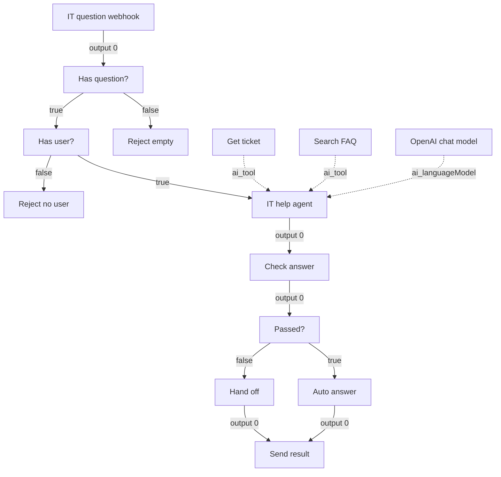

# 68 IT agent (from day 67)

- 노드 수: 14
- 연결 수: 14

실선: main 실행 흐름. 점선: AI 등 부속 연결 (실행 순서 아님).

```mermaid
flowchart TD
  n0["IT question webhook"]
  n1["Has question#63;"]
  n2["Has user#63;"]
  n3["Reject no user"]
  n4["Reject empty"]
  n5["IT help agent"]
  n6["OpenAI chat model"]
  n7["Search FAQ"]
  n8["Get ticket"]
  n9["Check answer"]
  n10["Passed#63;"]
  n11["Auto answer"]
  n12["Hand off"]
  n13["Send result"]
  n0 -->|"output 0"| n1
  n1 -->|"true"| n2
  n1 -->|"false"| n4
  n5 -->|"output 0"| n9
  n9 -->|"output 0"| n10
  n10 -->|"true"| n11
  n10 -->|"false"| n12
  n11 -->|"output 0"| n13
  n12 -->|"output 0"| n13
  n6 -.->|"ai#95;languageModel"| n5
  n7 -.->|"ai#95;tool"| n5
  n8 -.->|"ai#95;tool"| n5
  n2 -->|"true"| n5
  n2 -->|"false"| n3
```
